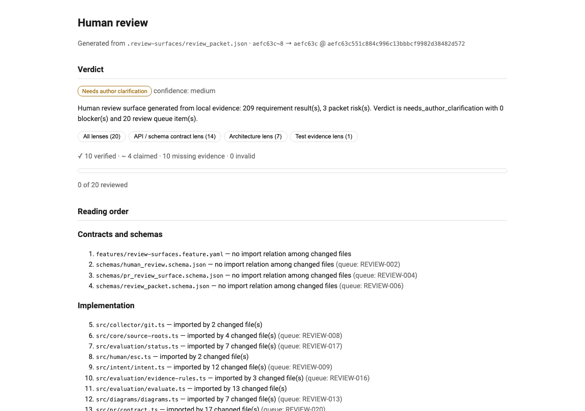
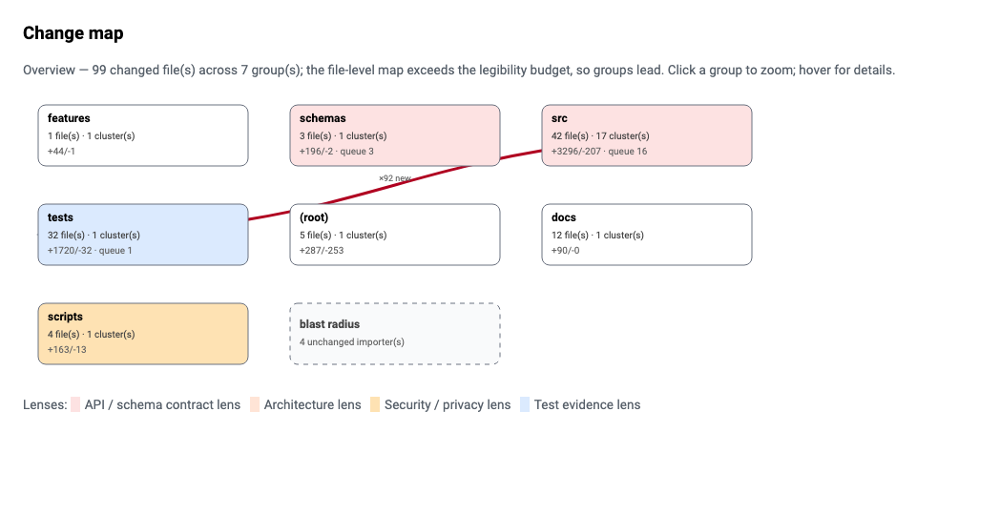
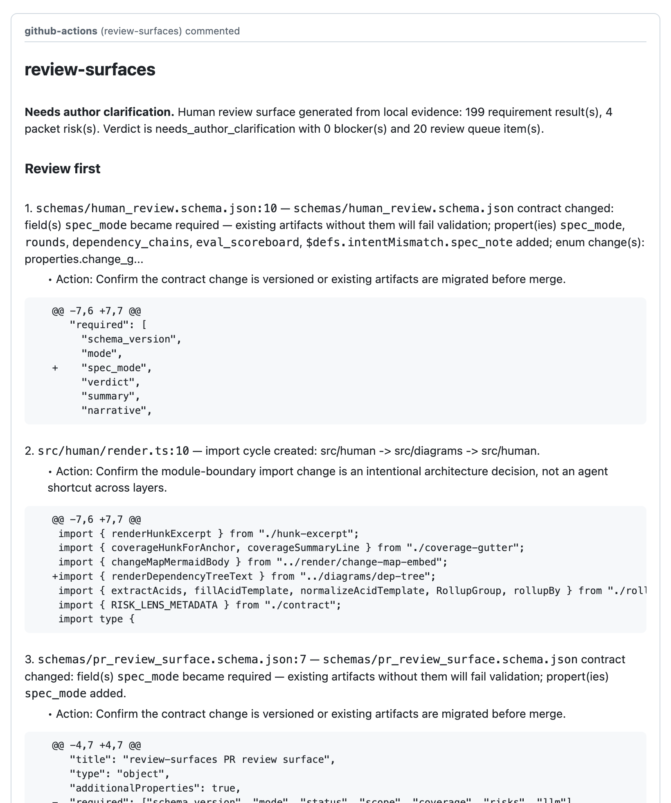

# review-surfaces

**The trust layer for agent-written code.** A local-first review cockpit that
answers the three questions a human actually has when reviewing a change an
agent produced:

1. **Did the agent overreach its instructions?** — a change-impact map, guided
   reading order, and semantic change facts (schema/API contract diffs, new
   dependencies, architecture drift) make the real scope of the diff concrete.
2. **Did the agent weaken tests to make them pass?** — test-weakening detection
   flags deleted tests, newly skipped tests, removed assertions, and regenerated
   snapshots as a first-class risk.
3. **Did the agent claim things it didn't do?** — a trust audit and
   per-sentence narrative trust markers separate verified claims from unbacked
   prose. *"The agent says the tests passed; no transcript backs it"* is a
   headline no generic review bot produces.

Every answer is grounded in local evidence — files, diffs, command transcripts,
coverage reports — never hidden chat context. Everything runs offline; the
default provider is deterministic and needs no API key.

**Read a packet before installing:** [`docs/example/`](docs/example/README.md)
holds the unedited output of a real run on a repository this tool had never
seen (`sindresorhus/got`, no spec, no config) — the markdown review, the HTML
cockpit, and the sticky comment, with the exact commands that produced them.

## Quickstart

Works on any git repository — no config, no spec files, no setup:

```bash
cd your-repo
npx review-surfaces all --base origin/main --head HEAD
open .review-surfaces/human_review.md     # or: npx review-surfaces human --format html
```

> Not on npm yet? Run it from source:
> `git clone https://github.com/Shaance/review-surfaces && cd review-surfaces && pnpm install --frozen-lockfile && pnpm run build`,
> then `node /path/to/review-surfaces/bin/review-surfaces.js all --base origin/main --head HEAD` inside your repo.

That one command produces a merge-readiness verdict, a ranked review-first
queue with inline diff excerpts and "why ranked here" lines, a guided reading
order for the diff, a change-impact map, a trust audit, reviewer questions, a
concrete test plan, and suggested review comments — all under
`.review-surfaces/`, all validated against checked-in schemas
(`npx review-surfaces validate .review-surfaces --surface all`).

## What you get

### The HTML cockpit

`review-surfaces human --format html` renders a single self-contained
`human_review.html` — verdict, lens filters, reading order, ranked queue with
per-line coverage gutters, clickable SVG change map, and progress tracking.
No server, no CDN, opens from disk:



### The change map

Two zoom levels, chosen by a legibility budget so the map is readable at any
diff size. Small diffs get the file-level map: changed files grouped by
module, import edges between them, churn and risk-lens tints, plus a halo of
the unchanged files that depend most on what changed. When a diff is too wide
to render legibly file by file, an **overview** leads instead — one card per
top-level area with file/cluster counts, churn, and weighted edges that
account for every import edge in the model — and clicking a card in the
cockpit zooms into that area's detail view (its files, internal edges, and
explicit "→ other-area ×N" stub ports). Rendered as deterministic inline SVG
in the cockpit and as mermaid on comment surfaces; layouts wrap instead of
shrinking, so nothing ever renders below full size:



### The sticky PR comment

A reusable GitHub Action (or `review-surfaces comment --format sticky` locally)
posts one idempotent comment per PR: verdict, top queue items with diff
excerpts, and a since-last-review delta on every push:



All three screenshots come from a real run of this tool on its own repository —
the project reviews itself with itself (see [`docs/history/`](https://github.com/Shaance/review-surfaces/tree/main/docs/history) for
that story).

## Scope: what the analysis actually covers

Honesty about depth, so you can calibrate trust:

- **TypeScript/JavaScript-first deep analysis.** The import graph, exported-API
  surface diff, blast radius ("this removed export is used by 14 files"), and
  architecture-drift facts parse TS/JS sources (via the TypeScript compiler).
  Implementation-root detection reads *your* repo's `tsconfig.json` and
  `package.json` — a `source/` layout classifies just like `src/`.
- **Language-agnostic everywhere else.** Test-weakening signals, secret
  scanning, coverage deltas (any `lcov.info`), dependency/lockfile facts, CI
  workflow and Dockerfile and SQL-migration checks, JSON-schema contract diffs,
  the change map's clustering, the trust audit, and the review queue itself work
  on any repository.
- **Deterministic by contract.** Identical inputs produce byte-identical
  artifacts. LLM output is optional enrichment and is never treated as proof —
  see [Providers](#providers).
- **Honest negatives.** No coverage report renders as "no coverage evidence",
  never as red. An unresolvable lockfile yields "no lockfile facts", never a
  guess. A truncated import graph suppresses drift facts rather than asserting
  novelty it cannot prove.

A seeded-regression eval harness gates review quality itself in CI — the
[scoreboard](#eval-scoreboard) at the bottom of this README is regenerated from
its results.

## The local review loop (no CI required)

```bash
pnpm run local-review   # produce every surface for your branch + validate them
pnpm run local-gate     # the full merge gate: lint, typecheck, tests,
                        # determinism-check, packaging smoke test, strict self-review
```

`local-review` accepts `--base <ref>`, `--head <ref>`, `--out <dir>`,
`--provider <name>`, and `--previous <dir>` (a prior packet for
since-last-review deltas; the last local run is auto-detected). Network use:
git only. GitHub Actions is a distribution channel for these surfaces, never
the only way to produce or verify them — `action.yml` in this repo is a thin
renderer over the same local pipeline.

## Commands

| Command | What it does |
| --- | --- |
| `all` | Run the whole local pipeline and write every surface. Add `--surface-mode pr` for the PR-scoped sidecar. |
| `human` | Render `human_review.json` / `human_review.md` (and `--format html` for the cockpit) from existing artifacts without recomputing. |
| `comment` | Render the PR comment. `--format sticky` for the idempotent sticky summary, `--format sarif` for SARIF, `--format review` for a GitHub pending (draft) review of the hunk-anchored suggested comments — never auto-submitted. |
| `review` | Interactive walkthrough of the ranked queue; accept / flag / false-positive / comment decisions feed local feedback memory so later runs adapt. |
| `validate [dir]` | Validate generated artifacts against the bundled schemas (`--surface packet\|human\|pr\|all`). Works from any directory. |
| `run [--id <id>] -- <cmd>...` | Execute a command and record a bounded transcript as direct evidence (this is how "tests passed" becomes verifiable). |
| `queue` / `comments` / `trust` / `risk-lenses` / `intent-mismatch` / `routes` / `evidence-cards` / `since-last-review` / `test-plan` | Focused standalone sections rendered from `human_review.json`. |
| `init [--force]` / `bootstrap [--strict]` | Scaffold (create-or-validate) or validate-only a repo's review-surfaces setup. |
| `scoreboard [--check]` | Regenerate (or verify) the README eval-scoreboard block from `eval_scoreboard.json`. |

Run `npx review-surfaces --help` for the full option list. Common options:
`--base` / `--head` (diff range), `--out` (artifact dir, default
`.review-surfaces`), `--provider mock|agent-file|ai-sdk`, `--coverage
<lcov path>` (auto-detects `coverage/lcov.info`), `--budget 15m` (read/skim/defer
review plan), `--previous-packet <path>` (round-over-round deltas).

## Providers

- **`mock`** (default): fully deterministic, offline. Everything in the tour
  above works in this mode.
- **`agent-file`**: a coding agent contributes bounded, schema-checked
  hypotheses via `--agent-input <json-or-yaml>` — no network.
- **`ai-sdk`**: optional live LLM enrichment (narrative prose over the
  deterministic facts). Privacy filtering and secret redaction run before any
  remote call; credentials live in a local `.env.local`, never committed.

LLM and agent output is never treated as proof: every claim must survive
deterministic anchor validation or it is demoted to a visibly-marked unverified
claim. LLM output cannot create or clear blockers, change coverage status, or
alter the verdict.

## Optional power-ups

The tool is fully useful with zero configuration. Each layer below is opt-in:

- **`review-surfaces.config.yaml`** — review areas, risk-lens toggles, bounded
  output caps, required manual checks per path pattern (e.g. "any
  `.github/workflows/**` change must record a secret-boundary check before the
  verdict can clear").
- **Acai-style feature specs** (`features/*.feature.yaml`) — the requirements
  ledger layer. With specs indexed, every requirement gets an
  implementation-and-test coverage status (`satisfied` / `partial` / `missing` /
  `overreach`), intent-vs-diff mismatch findings, and a strict quality gate
  (`--strict`) suitable for CI. Without specs, the packet simply says so once
  (`spec_mode: none`) and every diff-derived surface still works — spec-less
  repos are a first-class path, not a degraded mode.
- **`review-surfaces.policy.yaml`** — committed, schema-validated team policy:
  suppressions with reasons and expiry dates, severity overrides, required
  manual checks. Composes with (never replaces) local feedback memory.
- **Coverage, test results, and transcripts** — point `--coverage` at an lcov
  report, `--test-output` at JUnit XML, or wrap commands in `review-surfaces
  run` to upgrade "the author claims tests pass" into verified evidence.

## Install / develop

- Node.js `>= 22`, [pnpm](https://pnpm.io/) (version pinned via
  `packageManager`).

```bash
pnpm install --frozen-lockfile
pnpm run build      # compiles the CLI to dist/, executable at bin/review-surfaces.js
pnpm run test       # full suite (includes the seeded-regression eval harness)
```

See [`CONTRIBUTING.md`](https://github.com/Shaance/review-surfaces/blob/main/CONTRIBUTING.md) for the PR workflow and
[`AGENTS.md`](https://github.com/Shaance/review-surfaces/blob/main/AGENTS.md) for the agent-facing working rules (this repository
is developed spec-first and dogfood-first).

## Project layout

- `src/` — CLI and pipeline modules (collector, intent, evaluation, diagrams,
  methodology, risks, human cockpit, render, schema, privacy, providers).
- `schemas/` — draft 2020-12 contracts for the packet, the human review model,
  the PR sidecar, and the policy file (bundled with the package; `validate`
  works from any directory).
- `features/review-surfaces.feature.yaml` — the authoritative requirements
  ledger for this repo itself.
- `docs/history/` — the goal files and brainstorms this tool was built from,
  agent-first, reviewing itself at every phase.
- `.review-surfaces/` — generated, local-first artifacts.

## License

[MIT](./LICENSE).

<!-- review-surfaces:eval-scoreboard -->
### Eval scoreboard

The seeded-regression eval harness (run inside `pnpm run test`) currently catches **13/13** seeded case(s) across 13 fact class(es) in the top 10 of the review queue:

| fact class | cases in top N |
| --- | --- |
| api_break | 1/1 |
| arch_drift | 1/1 |
| benign_format | 1/1 |
| benign_redaction_placeholder | 1/1 |
| benign_rename | 1/1 |
| blast_radius | 1/1 |
| ci_permission_broadening | 1/1 |
| destructive_migration | 1/1 |
| schema_change | 1/1 |
| secret_in_diff | 1/1 |
| sneaky_dependency | 1/1 |
| uncovered_changed_lines | 1/1 |
| weakened_test | 1/1 |

_Generated by `review-surfaces scoreboard` from `.review-surfaces/eval_scoreboard.json`; do not edit inside the markers._
<!-- /review-surfaces:eval-scoreboard -->
