<!-- review-surfaces:sticky -->
## review-surfaces

**Needs author clarification.** Human review surface generated from local evidence: 0 packet risk(s). Verdict is needs_author_clarification with 0 blocker(s) and 0 review queue item(s).

### Review first

- No path-backed review queue items.

### Trust

- 0 verified, 0 claimed (unverified), 1 missing evidence, 0 invalid.

```mermaid
flowchart LR
  subgraph c0["source/core"]
    n0["source/core/index.ts<br/>+33/-20"]
    n1["source/core/options.ts<br/>+2/-0"]
  end
  subgraph c1["test"]
    n2["test/abort.ts<br/>+113/-8"]
    n3["test/pagination.ts<br/>+69/-0"]
  end
  subgraph c2["documentation"]
    n4["documentation/4-pagination.md<br/>+1/-0"]
  end
  subgraph c3["root"]
    n5["package.json<br/>+1/-1"]
  end
  n1 --> n0
  n0 --> n2
```

Change map

### Start reading here (Implementation)

1. `source/core/options.ts` — imported by 1 changed file(s)
2. `source/core/index.ts` — imported by 1 changed file(s)

_2 more leg(s) in the full reading order (human_review.md)._

<!-- review-surfaces:fingerprint head=a5b76bffb33d5fa8b0d1393cce410b88e7c2b848 keys= -->
