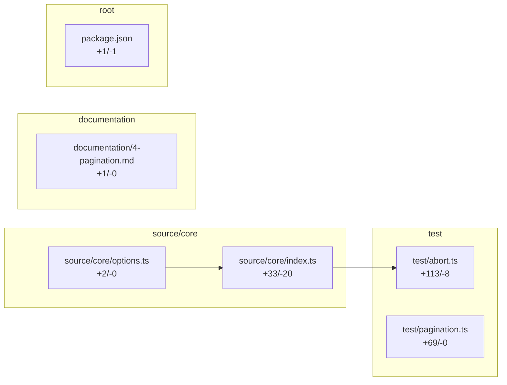

# Human Review

Generated from `review_packet.json`.

## Verdict

**Needs author clarification.**

Human review surface generated from local evidence: 0 packet risk(s). Verdict is needs_author_clarification with 0 blocker(s) and 0 review queue item(s).

Confidence: medium.

Reasons:
- Required review evidence is missing or claimed without proof. Required action: Record validation evidence or answer the generated reviewer questions. (READY-MISSING-EVIDENCE; medium)

## Reading order

**Implementation**
1. `source/core/options.ts` — imported by 1 changed file(s)
2. `source/core/index.ts` — imported by 1 changed file(s)

**Tests**
3. `test/abort.ts` — test — read after the 1 changed file(s) it imports
4. `test/pagination.ts` — test — read after the code it covers

**Config and docs**
5. `documentation/4-pagination.md` — config or docs — read last
6. `package.json` — config or docs — read last

## Change map

## Change narrative

_Source: fallback (mock); validated at `a5b76bffb33d5fa8b0d1393cce410b88e7c2b848`. ✓ verified, ~ claimed (unverified anchor)._
- ✓ The change touches 6 file(s). (anchors: `documentation/4-pagination.md`, `package.json`, `source/core/index.ts`, `source/core/options.ts`)

## Semantic change facts

- No semantic schema/API/test-weakening facts detected in this change.

## Review first

- No path-backed review queue items generated.

## Review routes

- Human reviewer route (default): Default path through the verdict, review queue, blockers, questions, trust audit, and test plan. Path: Merge readiness verdict -> Top review queue -> Blockers and author questions
- Maintainer route: Focuses on merge readiness, public contracts, required tests, and blocking comments. Path: Merge readiness verdict -> Schema, CLI, and artifact contracts -> Required tests and manual checks
- Security route: Focuses on security/privacy lenses, CI secret-boundary checks, provider/redaction changes, and manual-check evidence. Path: Security and LLM trust-boundary lenses -> CI, provider, and redaction paths -> Manual security checks
- Product route: Focuses on intent fit, reviewer-facing output, reviewer UX risks, and suggested comments. Path: Intent and reviewer workflow fit -> Reviewer UX lens -> Human review output
- Agent-continuation route (secondary): Secondary path for implementation agents to continue from open risks, missing tests, and deferrals. Path: Open risks and blockers -> Missing tests and manual checks -> Since-last-review open items

## Evidence cards

- No command transcript or validation feedback was supplied to prove test execution. Action: Ask the author to provide the missing evidence or record an explicit deferral. [Missing evidence; medium; evidence: direct 0, missing 1, invalid 0] (`CARD-001`)

## Blockers

- No merge blockers generated from deterministic evidence.

## Since last review

- No previous packet was supplied; pass --previous-packet to compare review rounds.

## Coverage evidence

- No coverage evidence: no coverage report was provided. This is different from changed lines being uncovered.

## Review plan

- No time budget configured (pass --budget 15m or set human_review.review_budget).

## Intent mismatch

- No requirement spec configured — intent checks are limited to docs and constraints.

## Questions for author

1. Which validation command or parsed test artifact should reviewers trust for this change? (clarifying; evidence: `No direct or indirect validation evidence found in risks.test_evidence.`)
2. What evidence closes this review gap: No command transcript or validation feedback was supplied to prove test execution.? (clarifying; evidence: `Run validation commands and preserve output externally or in a future command transcript artifact.`)

## Trust audit

Confidence summary: Medium confidence: 0 verified fact(s), 1 missing evidence item(s), and 0 unverified claim(s).

Verified:
- No verified facts recorded.

Claimed but not verified:
- No unverified claims recorded.

Missing:
- No command transcript or validation feedback was supplied to prove test execution. Evidence: `Run validation commands and preserve output externally or in a future command transcript artifact.`

Invalid:
- None recorded.

## Risk lenses

- No domain risk lenses fired.

## Test plan

- No concrete test-plan items generated.

## Suggested comments

### Clarifying comment (SC-001)

> I do not see direct validation evidence in the packet. Can you record the relevant test/typecheck command transcript or parsed test output?

Evidence: `No direct or indirect validation evidence found.`

Ready to post: yes.

## Skim-safe

- No skim-safe files identified.

## Feedback memory

- No reviewer feedback policy effects applied.

## Evidence pointers

- Packet: `review_packet.json`
- Review queue: `review_queue.md`
- Suggested comments: `suggested_comments.md`
- Trust audit: `trust_audit.md`
- Risk lenses: `risk_lenses.md`
- Intent mismatch: `intent_mismatch.md`
- Review routes: `review_routes.md`
- Evidence cards: `evidence_cards.md`
- Since last review: `since_last_review.md`
- Test plan: `test_plan.md`
- Base/head: `HEAD~3` -> `HEAD`
- Head SHA: `a5b76bffb33d5fa8b0d1393cce410b88e7c2b848`
